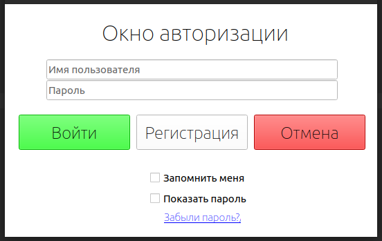
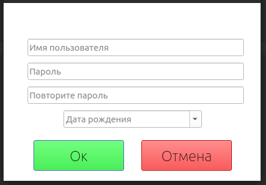
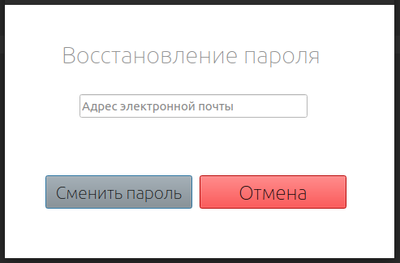
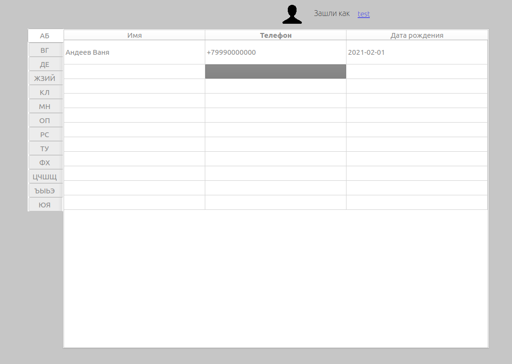
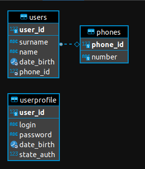

Справочник контактов с телефонными номерами.

Технологии:
- PyQt5
- Python 3.6
- SQLAlchemy==1.4.23
- MariaDB 10.4.20

Установка виртуального окружениия:

- virtualenv --python=python3.6 venv
- source venv/bin/activate
- pip install -r requirements.txt

Установка MariaDB 10.4 на Ubuntu

- sudo apt-get install software-properties-common
- sudo apt-key adv --fetch-keys 'https://mariadb.org/mariadb_release_signing_key.asc'
- sudo add-apt-repository 'deb [arch=amd64,arm64,ppc64el] https://mirror.truenetwork.ru/mariadb/repo/10.4/ubuntu focal main'
- sudo apt update
- sudo apt install mariadb-server
- sudo mysql_secure_installation

- Создать БД с названием list_phones (кодировка utf-8), либо внести название в переменную SQLALCHEMY_DATABASE_URI
- Указать в переменной SQLALCHEMY_DATABASE_URI логин и пароль для подключения

Создать таблицы в БД:
- python3 models.py

Загрузить фикстуры с тестовыми контактами:
- python3 fixtures.py

Запуск приложения:
- python3 run.py

Скриншоты:

Схема БД

